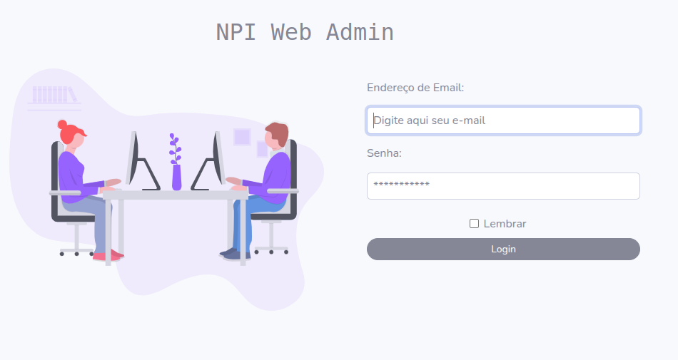
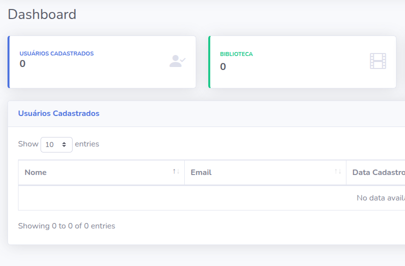
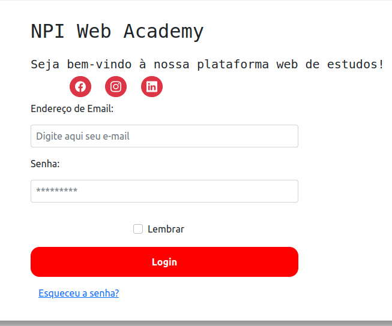
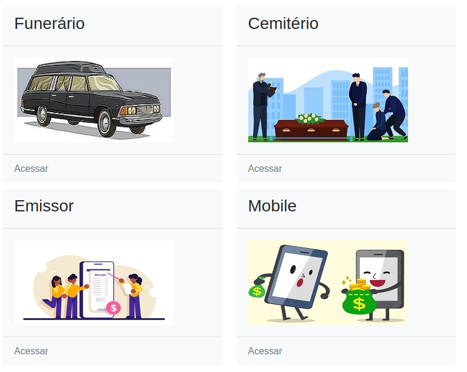

# NPI Academy
This system was developed for a client company with the goal of simplifying the delivery of training to their customers.
It features a dedicated interface for end users and an admin panel for managing and updating content. This ensures the platform remains up to date with the latest information about the systems, making the training process more efficient, flexible, and aligned with the client’s evolving needs.

✅ Requirements
Before running the application, ensure the following are installed on your system:

- Docker
- Docker Compose
- PHP version: 8.1.3
- Laravel version: 8.83.27

## 🚀 Project Preview
Admin:




Client:




## Installation and Setup

### 1. Clone the repository
```
git clone https://github.com/{user}/Npiweb_Academy.git
cd Npiweb_Academy
```

### 2. Environment configuration
```
cp .env.example .env
```

### 3. Start the containers and prepare the app
Run the following commands to start the Docker environment and install dependencies:
```
docker-compose up -d --build
```
Access the app container:
```
docker exec -it npi_app bash
```
Inside the container, run:
```
npm install
composer install
php artisan key:generate
php artisan migrate
php artisan db:seed
```

## 🌐 Accessing the Application
If everything is set up correctly, the application will be available at:
```
http://localhost:8080
```
